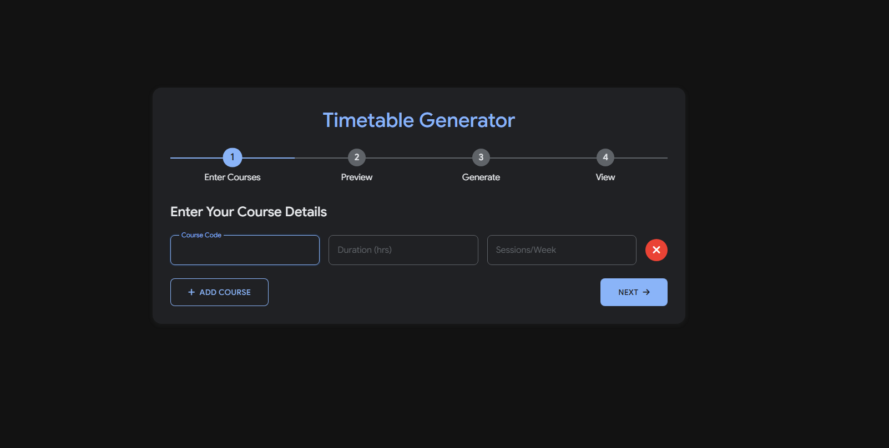

# 📅 Interactive Timetable Generator

A lightweight, browser-based solution for creating optimized academic or work schedules with an intuitive step-by-step wizard interface.



## ✨ Features

- **Interactive 4-Step Wizard** - Streamlined user experience with logical progression
- **Smart Scheduling Algorithm** - Optimized course placement with collision avoidance
- **Responsive Design** - Works on desktop, tablet, and mobile devices
- **No Server Required** - Pure client-side processing with zero dependencies
- **Print-Ready Output** - Professional, clean timetable layout ready for printing
- **Form Validation** - Prevents common user errors and duplicate entries
- **Custom Time Slots** - Different timeslots for weekdays vs. weekends

## 🔧 Technologies Used

- **HTML5** - Semantic markup structure
- **CSS3** - Modern styling with animations and transitions
- **Vanilla JavaScript** - No frameworks or libraries
- **Modular Architecture** - Separate JS files for specific functionality
- **Responsive Grid Layout** - CSS grid for the timetable display
- **Modern Web Fonts** - Google Fonts (Roboto) for typography

## 🧠 Algorithms & Techniques

### Course Scheduling Algorithm

The timetable generation uses a randomized greedy assignment algorithm with the following approach:

1. **Grid Initialization** - Creates a 2D matrix of all possible time slots across days
2. **Course Assignment** - For each course:
   - Attempts to schedule required sessions across different days when possible
   - Respects course duration (consecutive time slots)
   - Ensures no overlap with already scheduled courses
   - Uses a "tries" limit to prevent infinite loops

### Collision Avoidance Logic

The `isFree()` function validates availability by:
- Checking if a sequence of consecutive slots is available
- Confirming the course duration fits within the day's schedule
- Verifying no other course is already assigned to these slots

### Smart Session Distribution

- Prioritizes scheduling sessions on different days when possible
- Maintains a set of "used" days to track where a course has been placed
- Falls back to same-day scheduling if necessary to fulfill requirements

## 🚀 Getting Started

### Prerequisites
- Any modern web browser (Chrome, Firefox, Safari, Edge)

### Installation
1. Clone this repository or download the ZIP file
2. Extract files to your desired location
3. Open `index.html` in your browser

No build process, server, or installation required!

## 📋 User Flow

### Step 1: Enter Course Information
- Input course details including:
  - Course code (unique identifier)
  - Duration (how many consecutive hours each session takes)
  - Sessions per week (how many times the course meets weekly)
- Add as many courses as needed with the "+ Add Course" button
- Each entry is validated in real-time

### Step 2: Preview and Confirm
- Review all entered course information in a tabular format
- Make any necessary modifications
- Remove courses if needed
- Confirm the data is correct before proceeding

### Step 3: Generate Timetable
- Briefly displays a loading animation while the scheduling algorithm works
- Processes all course requirements and constraints
- Creates an optimized schedule that attempts to:
  - Distribute sessions across different days
  - Avoid time conflicts
  - Respect course durations

### Step 4: View and Export
- Display the final generated timetable in a grid layout
- Days of the week are shown across columns
- Time slots are shown in rows
- Each cell displays the assigned course code (if any)
- Export options:
  - Print directly from the browser
  - Start over with the "New" button

## 🔍 Project Structure

```
timetable-generator/
├── index.html         # Main wizard interface
├── timetable.html     # Direct timetable view
├── css/
│   └── style.css      # Styling and animations
├── js/
│   ├── app.js         # Step navigation logic
│   ├── form.js        # Form handling and validation
│   └── timetable.js   # Schedule generation algorithm
└── assets/
    └── favicon.ico    # Favicon
```

## 🛠️ Customization Options

The timetable generator can be easily customized by modifying:

- **Time slots** - Edit the `weekdaySlots` and `saturdaySlots` arrays in `timetable.js`
- **Days** - Modify the `days` array in `timetable.js`
- **Styling** - Customize appearance in `style.css`
- **Validation rules** - Adjust form validation in `form.js`

## 📝 Limitations & Future Improvements

- Currently limited to predefined time slots
- No persistence (refreshing page clears all data)
- Does'nt considers lunch breaks
- Future plans:
  - Local storage for saving timetables
  - Export to calendar formats (iCal, Google Calendar)
  - Additional constraints (teacher availability, room assignments)
  - Drag-and-drop interface for manual adjustments

## 👥 Contributing

Feel free to fork this project and submit pull requests! Areas for improvement include:

- More sophisticated scheduling algorithms
- Additional export options
- Enhanced UI/UX
- Mobile app wrapper

## 📜 License

This project is licensed under the MIT License - see the LICENSE file for details.

---